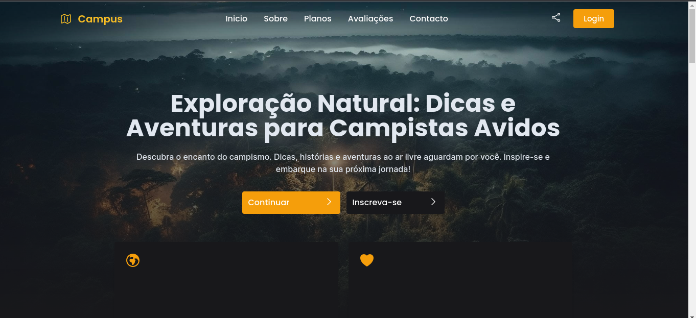
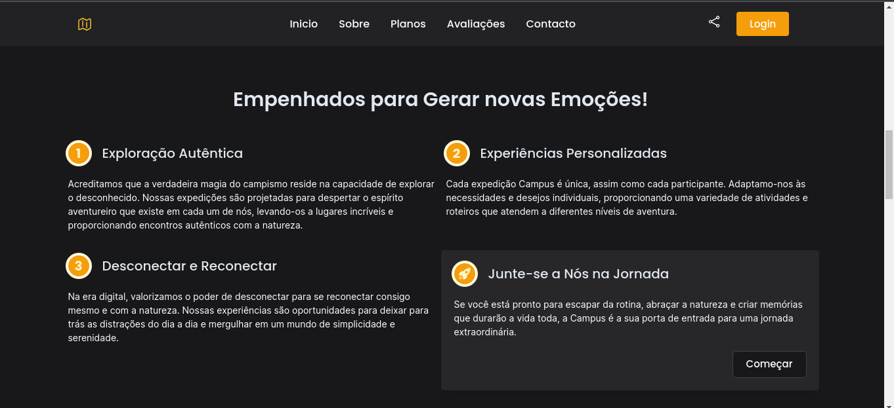
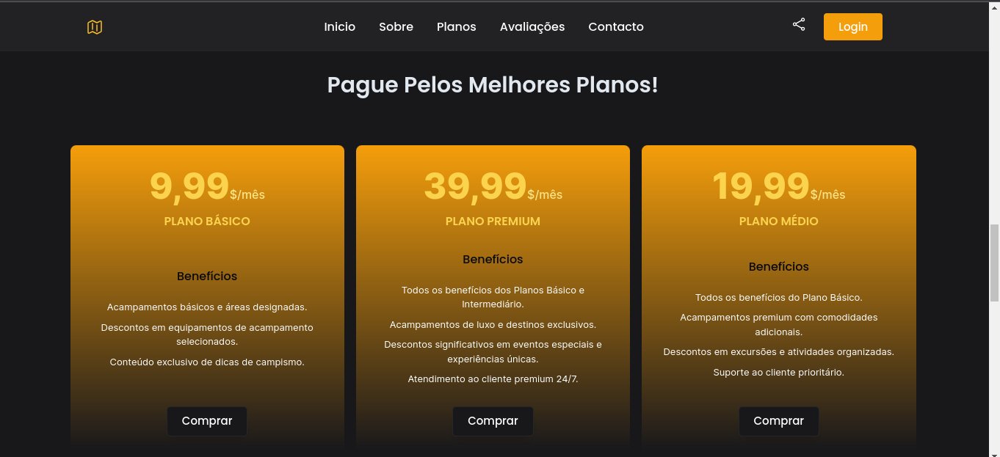
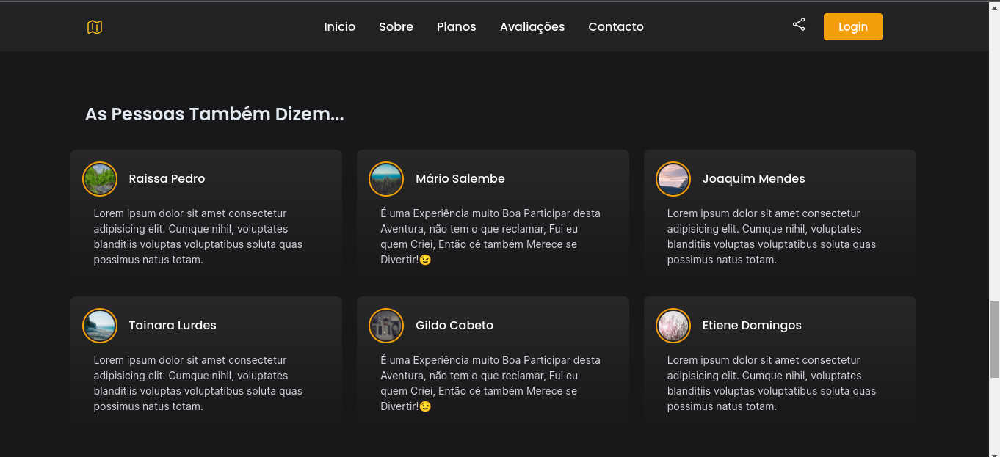

#Campus - Campismo e Descoberta

**Campus** é um Projecto Front-end, um Site de Campismo para Novas Aventuras e Descobertas incríveis para Estimular a mente e 
Entreter as Pessoas!

### Tecnologias Usadas
- HTML, CSS
- JS
- TAILWIND CSS

### Imagens

### Links
[Instagram](https://www.instagram.com/mariosalembe22) | [Linkedim](https://www.linkedin.com/in/m%C3%A1rio-salembe-093797246/) | [URL LIVE](https://mariosalembe23.github.io/campus.github.io/)
